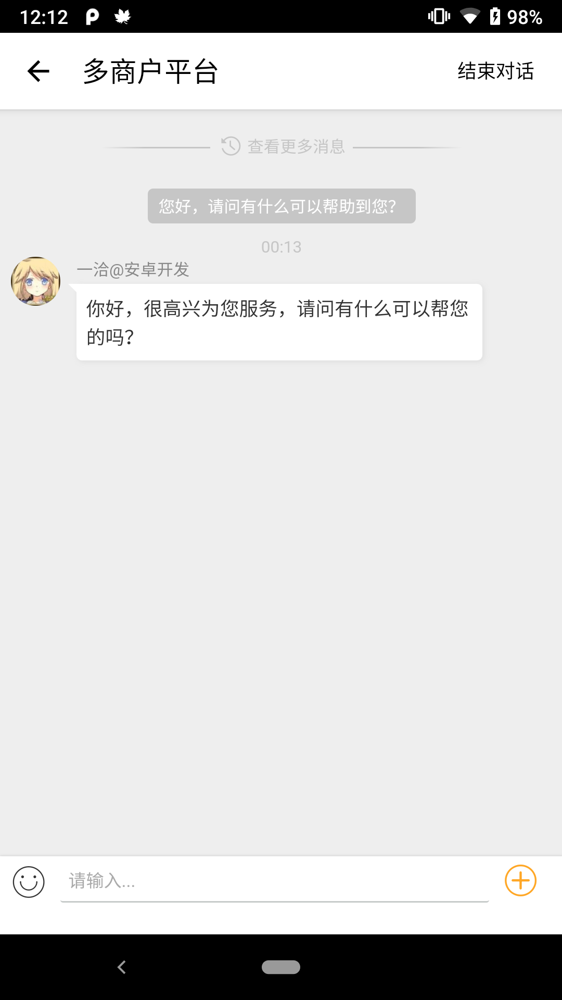

# 一洽客服  Android快速接入模块

为方便开发者快速接入，提供封装好的模块`chatlib`，可直接导入至工程 或 通过 `Gradle`接入，两者区别前者适合开发者有较多定制修改需求，后者适合快速接入无需大量定制。

更多关于接入文档，请浏览[一洽JSAPP-Android集成](http://doc.echatsoft.com/api/sdk/js-app/#!android/quickstart.md)


## 项目介绍

项目目录中，app为demo，`chatlib`为封装的多商户模块，开发者可以直接导入`chatlib`。


注意：chatlib 使用了`FileProvider`，如您的项目也使用了`FileProvider`，请修改EChatFragment中的`openGallery()`方法中，使用的FileProvider(您可改成你项目中使用的图库选择器)。

### 打开对话

`EChatActivity`

```java
    /**
     * 打开对话
     *
     * @param companyId    公司id
     * @param pushInfo     推送信息
     * @param metaData     客户加密数据
     * @param visEvt       图文消息
     */
    public static void openChat(Context context, String companyId, String pushInfo, String metaData, String visEvt, String echatTag)
```

`pushInfo`可为任意数据，一洽建议pushInfo数据可为当前设备唯一码等信息，用于业务系统对接时，开发者无需查询用户设备信息，快速将未读消息推送至对应设备。请参阅[一洽在线客服系统-实时接收离线推送消息](http://doc.echatsoft.com/api/getEchatDataInTime/receivePushData.html)

平台校验码 相关文档可参考 [2.获取一洽对话窗口地址](http://doc.echatsoft.com/api/sdk/js-app-platform/#!android/quickstart.md#2.%E8%8E%B7%E5%8F%96%E4%B8%80%E6%B4%BD%E5%AF%B9%E8%AF%9D%E7%AA%97%E5%8F%A3%E5%9C%B0%E5%9D%80) ，并提供了工具`com.github.echat.chat.utils.EChatUtils.getSHA1(String token, String appid, String companyId)`

图文消息为JSON字符串，需要开发者进行URLencode，请参阅[图文消息](http://doc.echatsoft.com/api/sdk/js-app-platform/#!android/quickstart.md#7.%E5%9B%BE%E6%96%87%E6%B6%88%E6%81%AF)、[Echat-访客发送图文消息](https://wiki.echatsoft.com/rel/tuwenfangke.html)

metadata 客户加密数据用于业务系统会员对接，请参阅[Echat-业务对接](https://wiki.echatsoft.com/rel/yewuduijie.html)，提供了工具`com.github.echat.chat.utils.EChatUtils.create2MetaData(Map<String, Object> metaData,String encodingKey, String appId)`，但建议metaData数据仅在服务端进行加密

### UI界面修改




可通过`echat_styles.xml`中的EChatTheme及其子style，可对UI颜色主题进行修改。`layout_fr_echat.xml`为对话窗口主布局。

### 初始化Webview

`com.github.echat.chat.EChatFragment.initChatView(String url)`初始化聊天窗口

### 处理Echat网页 JS交互

重点参考以下对象和方法

- `com.github.echat.chat.EChatFragment.EchatJavaBridge`
  - `sendCompanyId`获取对话账号ID
  - `sendWebsocketTime`获得本次对话的对话时间 远程消息延迟到达可通过此值屏蔽
  - `video`接管播放视频
  - `previewImage`接管浏览图片
  - `openLinkV2`接管打开连接
  - `chatStatus`访客对话状态变更，根据状态进行UI等业务上的变更
  - `visitorEvaluate`访客评价反馈
  - 等等
- `com.github.echat.chat.EChatFragment.handleChatStatus() /handleVisitorEvaluate()`处理访客对话状态变更 UI以及页面行为变更
- `com.github.echat.chat.EChatFragment.closeChatView()` 关闭对话窗口(并通知一洽JS断开连接)

上述接管功能，需APP主动告知JS，请参考以下方法
- `com.github.echat.chat.EChatFragment.onPageFinished`

#### openLinkV2 接管打开连接

可打开半屏原生界面，发送图文消息(订单等)。


请参考`com.github.echatmulti.sample.App.interceptOpenLink`方法实现内容，和`com.github.echat.chat.EChatFragment`搜索`openLinkV2`查看实现内容

### 自定义
完全导入chatlib library，该项目gradle带有图库选择器，图库浏览，视频播放等，开发者可将预制功能换成开发者项目中已有。

- `com.github.echat.chat.EChatFragment.previewImage` 接管图片浏览
- `com.github.echat.chat.EChatFragment.playVideo` 接管视频播放

#### 图片/视频/文件 上传
因Webview限制，Webview的上传，仅为文件上传，如需实现图片/视频/文件多种方式上传，是需开发者进行原生开发。模块实现类微信相机/图片选择的功能，供开发者参考。
- `com.github.echat.chat.EChatFragment.openCameraOrGallery` 显示dialog 选择类微信相机/图片选择功能‘
- `com.github.echat.chat.EChatFragment.showBottomSheetDialog` dialog方法
- `com.github.echat.chat.EChatFragment.openCamera` 打开类微信自定义相机
- `com.github.echat.chat.EChatFragment.openGallery` openGallery()

如需自行开发，请注意以下方法/对象
- `com.github.echat.chat.EChatFragment.openFileChooser`
- `com.github.echat.chat.EChatFragment.endToUpload`
- `com.github.echat.chat.EChatFragment.mWebChromeClient`

**注意！注意！注意！**
无论用户是否选择上传/取消上传，都应参照`endToUpload`方法，对回调进行调用。

### 消息通知处理
本地消息/远程消息的处理。Demo中仅采用的简单的方法进行演示和封装。
#### 本地消息
将通过广播的形式，通知到外部。

Android 8.0 静态Receiver无法接受到消息，这里采用双向自定义权限，即可接收。

```
<receiver
            android:name=".utils.NotificationReceiver"
            android:enabled="true"
            android:exported="false"
            android:permission="com.echat.chat.SEND_PERMISSION">
            <intent-filter>
                <action android:name="com.echat.chat.action.NEW_MSG" />
                <action android:name="com.echat.chat.action.UNREAD_COUNT" />
            </intent-filter>
        </receiver>
```

```java
public class NotificationReceiver extends BroadcastReceiver {

    private static final String TAG = "NotificationReceiver";
    private List<Intent> intents;

    @Override
    public void onReceive(Context context, Intent intent) {
        String action = intent.getAction();
        Bundle bundle = intent.getExtras();
        /**
         * 接受chatlib 发来的本地消息(什么是本地消息 根据业务需求定义 可参考chatlib的逻辑)
         */
        if (Constants.ACTION_NEW_MSG.equals(action)) {
            LogUtils.iTag("chatLib", bundle);
            String companyIdString = bundle.getString(Constants.CHAT_COMPANY_ID, "");//公司ID
            String companyName = bundle.getString(Constants.CHAT_COMPANY_NAME, "");//用作通知标题
            String chatUrl = bundle.getString(EXTRA_CHAT_URL, "");//可作为点开通知，直接打开的地址
            String msgContent = bundle.getString(Constants.CHAT_MSG_CONTENT, "");//客服/系统发送的消息内容
            int unreadMsgCount = bundle.getInt(CHAT_UNREAD_COUNT);//这个用户的所有未读消息数
            int msgType = bundle.getInt(Constants.CHAT_NEW_MSG_TYPE);//是对话新消息/平台新消息
            //来自对话的本地消息用
            if (msgType == Constants.TYPE_NEW_MSG_FROM_CHAT) {
                //默认 平台多商户版 不启用该功能 则可忽略
                RemoteNotificationUtils.cancel(context, Integer.parseInt(companyIdString));
                RemoteNotificationUtils.getInstance(context)
                        .setCount(unreadMsgCount)
                        .setNotificationId(Integer.parseInt(companyIdString))
                        .showNotification(companyName, msgContent, null, null, new HashMap<String, String>() {{
                            put(EXTRA_COMPANY_ID, companyIdString);
                            put(EXTRA_CHAT_URL, chatUrl);
                        }});
            }
        }
        //接受未读消息数变更
        else if (Constants.ACTION_UNREAD_COUNT.equals(action)) {
            int notificationCount = bundle.getInt(CHAT_UNREAD_COUNT);
            //用于远程推送如果有时间戳，可根据这个时间戳，排除推送延迟的消息
            long lastChatTime = bundle.getLong(CHAT_LAST_CHAT_TIME);
            SPUtils.getInstance().put(LASTCHAT, lastChatTime);
            SPUtils.getInstance().put(UNREAD_COUNT, notificationCount);
            SPUtils.getInstance().put(REMOTE_UNREAD_COUNT, 0);//都连接上了 不存在远程未读
        }
    }
}
```


#### 远程消息

注：远程消息需要开发者进行后端开发，对接服务器交互，实现逻辑参照[6.实现远程推送]([http://doc.echatsoft.com/api/sdk/js-app-platform/#!android/quickstart.md#6.%E5%AE%9E%E7%8E%B0%E8%BF%9C%E7%A8%8B%E6%8E%A8%E9%80%81](http://doc.echatsoft.com/api/sdk/js-app-platform/#!android/quickstart.md#6.实现远程推送))。

实现远程消息，可参考Demo `com.github.echatmulti.sample.App`中搜索`dealWithNotificationMessage`方法

远程消息下发，带上服务器提供的消息时间戳，即可比对最后一次对话时间，避免远程消息延迟到达，导致的重复通知。

### 获得未读消息数

指通过一洽提供HTTP API 获得某访客在某公司/商户的未读消息数。

请参考`com.github.echat.chat.utils.EChatUtils`中

```java
		/**
     * 获得未读消息数
     *
     * @param companyId    公司ID 必须
     * @param metaData     metaData/(visitorId/encryptVId) 二选一
     * @param visitorId    metaData/(visitorId/encryptVId) 二选一
     * @param encryptVId   metaData/(visitorId/encryptVId) 二选一
     * @param callback
     */
    public static void getUnreadCount(@NonNull Context context,
                                      @NonNull String companyId,
                                      String metaData,
                                      String visitorId,
                                      String encryptVId,
                                      GetUnreadCountCallback callback)
```

API文档请参阅 [一洽客服系统访客端API-HTTP接口](http://doc.echatsoft.com/api/visitor/httpAPI.html)

### 发送图文消息

指通过一洽提供HTTP API ，在访客对话过程中，通过HTTP请求发送图文消息。

请参考`com.github.echat.chat.utils.EChatUtils`中

```java
		/**
     * 发送图文消息
     *
     * @param companyId    公司ID 必须
     * @param metaData     metaData/(visitorId/encryptVId) 二选一
     * @param visitorId    metaData/(visitorId/encryptVId) 二选一
     * @param encryptVId   metaData/(visitorId/encryptVId) 二选一
     * @param visEvtJSON   图文消息JSON 必须
     * @param callback
     */
    public static void sendVisEvt(@NonNull Context context,
                                  @NonNull String companyId,
                                  String metaData,
                                  String visitorId,
                                  String encryptVId,
                                  @NonNull String visEvtJSON,
                                  SendVisEvtCallback callback)
```

API文档请参阅 [一洽客服系统访客端API-HTTP接口](http://doc.echatsoft.com/api/visitor/httpAPI.html)